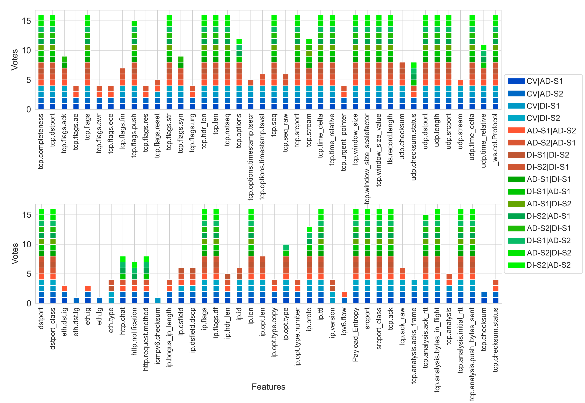
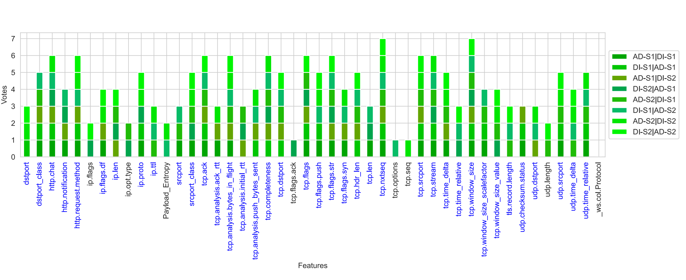

# GeMoDI: Generalizable Models for Device Identification in IoT Networks.

# Overview
In this repository you will find a Python implementation of the methods in the paper [GeMoDI: Generalizable Models for Device Identification in IoT Networks]()

# Abstract

With the proliferation of Internet of Things (IoT) devices, ensuring their security has become paramount. Device identification (DI), which distinguishes IoT devices based on their traffic patterns, plays a crucial role in both distinguishing devices and identifying vulnerable ones, closing a serious security gap. However, existing approaches to DI often overlook the challenge of model generalizability across diverse network environments. In this study, we propose a novel framework to address this limitation by evaluating the generalizability of DI models across datasets collected within different network environments. Our approach involves a two-step process: first, we conduct feature and algorithm selection using a genetic algorithm with external feedback, utilizing datasets from distinct environments (UNSW- AD and UNSW-DI). Then, we test the selected features and algorithm on independent datasets (MonIoTr-US and MonIoTr- UK) to assess model generalizability with cross-dataset validation. We demonstrate the effectiveness of our method by empirically comparing it to alternatives and highlight how fundamental flaws in commonly employed techniques, such as sliding window statistics and flow statistics, limit their generalizability. By openly sharing our code and analyses, we promote transparency and reproducibility. Our findings advance research in IoT security and device identification, offering insights into improving model effectiveness and mitigating risks in IoT networks. 


# Requirements and Infrastructure: 

Wireshark and Python 3.10 were used to create the application files. Before running the files, it must be ensured that [Wireshark](https://www.wireshark.org/), [Python 3.10+](https://www.python.org/downloads/) and the following libraries are installed.

| Library | Task |
| ------ | ------ |
|[ Sklearn ](http://scikit-learn.org/stable/install.html)| Machine Learning & Data Preparation |
| [ Numpy ](http://www.numpy.org/) |Mathematical Operations|
| [ Pandas  ](https://pandas.pydata.org/pandas-docs/stable/install.html)|  Data Analysis|
| [ Matplotlib ](https://matplotlib.org/users/installing.html) |Graphics and Visuality|
| [Seaborn ](https://seaborn.pydata.org/) |Graphics and Visuality|


## Datasets
The datasets we used in our study are listed below.

| Dataset | Capture year | Number of Devices | 
|---|---|---|
|[UNSW-DI ](https://iotanalytics.unsw.edu.au/iottraces.html)|2016|24|
|[UNSW-AD ](https://iotanalytics.unsw.edu.au/attack-data.html)|2018|24|
|[MonIoTr](https://moniotrlab.khoury.northeastern.edu/publications/imc19/)| 2019|81|


# Methodology

GeMoDI introduces a novel framework for evaluating the generalizability of DI models across diverse network environments. Our approach leverages a two-step process:

* **Feature and Algorithm Selection:**  Using a genetic algorithm with external feedback, we select features and algorithms from datasets collected in distinct environments (UNSW-AD and UNSW-DI).  To do this we used the devices that intersect between these two datasets. Fig. 1 shows the list of these devices.

   *Fig.1 Devices represented in the UNSW-DI (blue) and UNSW-AD (yellow) datasets, along with their intersection (grey).*


* **Cross-Dataset Validation:** We validate the selected features and algorithms on independent datasets (MonIoTr-US and MonIoTr-UK) to assess model generalizability. In this process, we tested models trained on data from one of the UK or US sites using data from the other site. The devices that were present at both sites are listed in Fig. 2.

   *Fig.2 Devices represented in the MonIoTr dataset from both UK and USA sites, along with their intersection (grey).*


* **Comparison of Alternative Methods:**  We empirically compare our package-based approach to alternative methods, demonstrating that models built on individual package features consistently outperform those based on streaming or window-based statistical methods in terms of generalizability. To ensure fairness, we apply the same feature and algorithm selection processes for flow and window methods as we do for each step of GeMoDI. Additionally, we compare these methods to our packet header-based approach, GeMoDI, and IoTDevID—another packet header-based method chosen as a baseline due to its robustness, transparency, and demonstrated superiority over other approaches.

## 001-Feature Extraction

A Python script and Wireshark are employed to extract features from `pcap`  files, generating data in `CSV`  format for machine learning applications. The UNSW datasets consist of session/`pcap`  files, capturing daily activities. An accompanying Excel file lists these sessions, detailing the devices involved and the number of samples they contain. Due to the large size of the datasets, a subset of sessions was selected for analysis, ensuring representation from each device. Since one session did not include samples from all devices, two sessions were merged to create a comprehensive dataset for the experiments.

`16-10-03.pcap` + `16-11-22.pcap` -> `DI-Session-1` (DI-S1)\
`16-09-29.pcap` + `16-11-18.pcap` -> `DI-Session-2` (DI-S2)\
`18-10-13.pcap` + `18-06-14.pcap` -> `AD-Session-1` (AD-S1)\
`18-10-16.pcap` + `18-06-11.pcap` -> `AD-Session-2` (AD-S2)


We have used the python scripts given in the links to extract features in [GeMoDI](https://github.com/kahramankostas/GeMoDI/blob/main/001-FeatureExtraction/GeMoDI/GeMoDI-FE.ipynb), [Kitsune](https://github.com/kahramankostas/GeMoDI/blob/main/001-FeatureExtraction/OtherMethods/Kitsune/Kitsune-FE.ipynb), [IoTDevID](https://github.com/kahramankostas/GeMoDI/blob/main/001-FeatureExtraction/OtherMethods/IoTDevID/IoTDevID-Features_Extraction.ipynb), [CICFlowmeter](https://github.com/kahramankostas/GeMoDI/blob/main/001-FeatureExtraction/OtherMethods/CICFlowMeter/002-CICFlowMeter-FE.ipynb) methods.
 
We used four UNSW data partitions (AD-S1, AD-S2, DI-S1, DI-S2) for feature selection, assessing feature generalizability through three evaluation methods: 5-fold cross-validation (CV) within a partition, session versus session (SS) comparisons within the same dataset, and dataset versus dataset (DD) comparisons across different datasets. This process created 16 evaluation contexts (see Fig. 3).

   \
   *Fig. 3 Data usage across different evaluation contexts. CV, SS, and DD steps are visualized in shades of blue, red, and green, respectively, throughout the paper for clarity. In the nomenclature, CV|AD-S1 denotes cross-validation on the AD dataset session 1. For cases other than CV, the first dataset is used for training and the second for testing. For example, AD-S1|DI-S2 means the first session of the UNSW-AD dataset is used for training and the second session of the UNSW-DI dataset is used for testing.*


## 002-Feature Selection

After feature extraction, the generalizability of each feature was evaluated using decision tree (DT) models due to their speed and explainability, and performance was measured by the kappa metric, which adjusts for chance agreement. (See [FatureReduction.ipynb](https://github.com/kahramankostas/GeMoDI/blob/main/002-FeatureSelection/GeMoDI/001-FatureReduction.ipynb))

A voting system was used where non-zero kappa values indicated the positive contribution of a feature. Features that received four or more votes from the SS (red) or DD (green) categories, including at least one DD vote, advanced to the next stage. As DD and SS provide stricter generalizability assessments, features that did not meet this criterion were eliminated. Although CV was used to evaluate features, its votes were excluded from the final selection due to potential information leakage. As a result, 46 out of 339 features were individually identified as predictors (see Fig 5).

   \
   *Fig. 4 Comparison of kappa scores for various features in UNSW datasets using CV and isolated methods (SS and DD). The CV method tends to overestimate feature utility, showing higher scores for many attributes, while SS and DD produce more realistic evaluations. This discrepancy highlights the potential for information leakage in cross-validation and the importance of using isolated validation methods for assessing feature utility in ML-based DI models.*


   \
   *Fig. 5 A voting system that gives one vote to each feature with a kappa value different from 0 that is individually predictive within CV, SS & DD.*


We used a wrapper method, specifically a Genetic Algorithm (GA), to explore feature interactions and identify optimal feature combinations. The GA’s global search capabilities allow for effective solutions within a reasonable timeframe. However, although it does not guarantee finding the optimal subset and it can include potentially non-functional features. Additionally, GA-selected features may become biased towards the training data, reducing their generalizability to other datasets.

   \
   *Fig. 6 A Visualisation of feature selection with Genetic Algorithm. The GA outputs the best feature set from n generations with the feedback it receives from the validation dataset*


To mitigate this, we combined all 46 features that passed individual voting into a single feature set for GA selection. A decision tree (DT) model evaluated the features, with fitness assessed by the F1 score across eight additional DD datasets, providing external validation and feedback to the GA. This ensured the selected features performed well across multiple datasets, not just the one used for selection. The GA identified separate successful feature sets for each DD case, even when starting with the same input set. In total, eight distinct feature sets were proposed by the GA, and we analyzed the intersections among them. Some features, such as tcp.window size and tcp.ack, were selected multiple times, while others, like tcp.seq and tcp.flags.ack, were chosen only once (see Fig. 7 and [GeneticAlgorithm.ipynb](https://github.com/kahramankostas/GeMoDI/blob/main/002-FeatureSelection/GeMoDI/002-GeneticAlgorithm.ipynb))


   \
   *Fig. 6 List of intersecting features identified across eight dataset versus dataset (DD) cases using Genetic Algorithm (GA).*


 
# License
This project is licensed under the MIT License - see the [LICENSE](LICENSE) file for details


# Citations
If you use the source code please cite the following paper:

*Kahraman  Kostas,  Mike  Just,  and  Michael  A.  Lones.   Individual Packet Features are a Risk to Model Generalisation in ML-Based Intrusion Detection., arXiv preprint, arxiv:2406.07578, 2024*


```
@misc{kostas2024GeMoDI,
      title={GeMoDI: Generalizable Models for Device Identification in IoT Networks.}, 
      author={Kahraman Kostas and Rabia Yasa Kostas and Mike Just and Michael A. Lones},
      year={2024},
      eprint={----},
      archivePrefix={arXiv},
      primaryClass={cs.CR}
}
```

Contact:
*Kahraman Kostas
kahramankostas@gmail.com*

